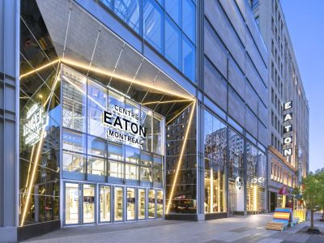
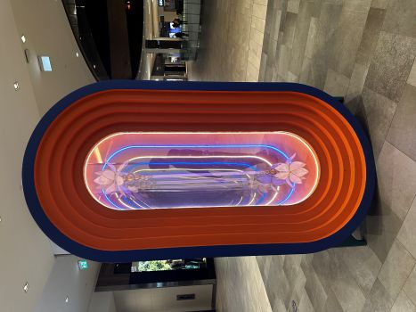
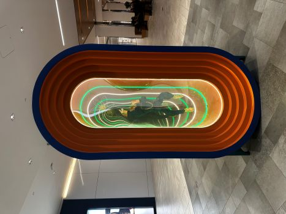
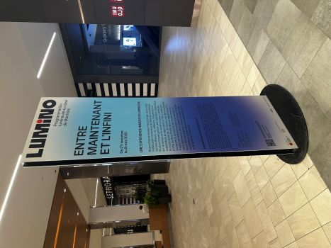
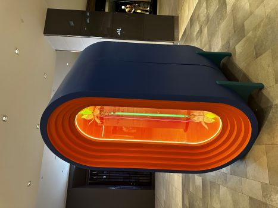
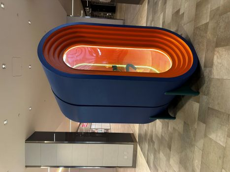
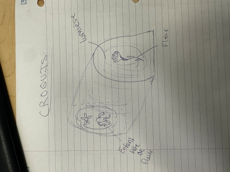
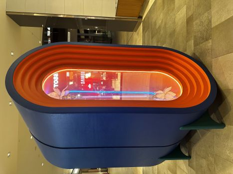
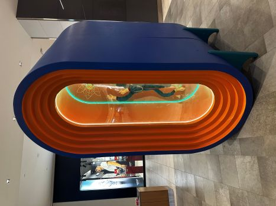
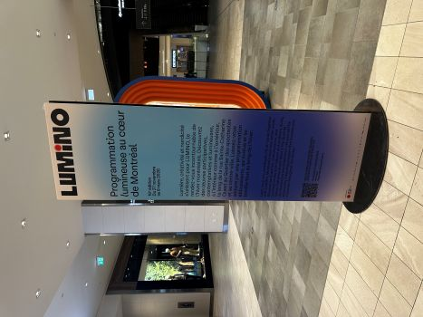

# Entre maintenant et l'infini

Pour mon exposition, je suis allé au Centre Eaton, à Montréal.

>Photo prise sur Internet

## Mon exposition
Pour ce projet, j'ai dû aller visiter une exposition intérieure se nommant Entre maintenant et l'infini. J'y suis allé le samedi 7 mars 2026. Voici quelques photos montrant l'oeuvre en entier:

  

## À propos du la réalisation
Cette exposition a été réalisé par l’artiste montréalais Jeremy Shantz en 2025. Elle a ensuite été exposé du 27 novembre 2025 au 8 mars 2026. 

## Explication de l'oeuvre
Pour vous résumer l'explication de cette oeuvre, l'artiste voulait démontrer comment on peut utiliser la lumière comme matière vivante. D'un bord, nous avons une fleur, qui représente l'infinis. Ces reflets crée une architecture d'expension et de renouveau. C'est une métaphore qui décrie le cycle de la vie. De l'autre côté, nous avons une sorte d'enfant avec une tête de fleur qui représente l'espace infini. Elle évoque la continuité de l’existence et le fragile lien entre l’humain et le naturel. Voici la page explicative: 

 
 > Photo prise par Félix Roy

## Type d'installation
Cette oeuvre est de type contemplative. Elle est en plein centre du Centre Eaton et elle est ouverte à la vue de tout le monde. Comme on peut le voir sur ces photos: 

 
> Phoo prise par Félix Roy

## Fonction du dispositif multimédia
Le seul dispositif multimédia utilisé, c'est la lumière. Cette oeuvre essaie de montrer qu'avec les reflets et la lumière, on peut avoir un message beaucoup plus concret que seulement un aspect visuel. Le reflet devient l'espace et le spectateur, le mouvement. 

 
> Photo prise par Félix Roy

 ## Mise en espace
 L'oeuvre est en plein milleu du corridor du 3e étage du Centre Eaton.
 
 
> Photo prise par Félix Roy

## Composantes et techniques
Les composantes utilisées sont les lumières et les objets à l'intérieur de l'oeuvre. 

 
 
## Éléments nécessaires à la mise en exposition 
Il n'y a pas d'éléments nécessaires à part la fiche de documentation et l'exposition en tant que telle

## Expérience vécue
Je n'ai pas eu réellement d'expérience, car cette exposition était ouverte à tout le monde donc je n'avais pas de personnel qui pouvais m'aider en cas de besoin. Je pouvais seulement regardé et contemplé l'oeuvre.

## Appréciation
Je n'ai pas aimé cette oeuvre au niveau physique. Je trouve que lorsqu'on regarde cette expostion, on ne comprends rien et même si on lis la description, c'est difficile de vraiment comprendre la réelle explication de celle-ci. Magré cela, après avoir vraiment compris ce qu'elle représentais, j'aime ce qu'elle dégage. 

