# La science en grand

Pour mon exposition choisie, j'ai choisi de prendre l'exposition permanente "La science en grand" au Centre des sciences:

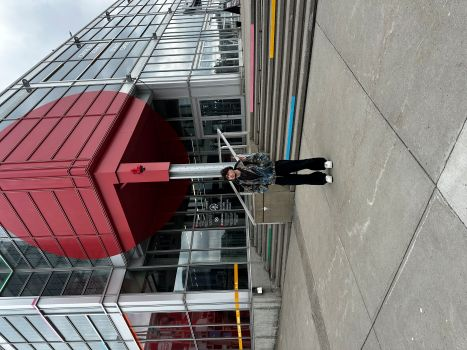
>Photo prise par Félix Roy

## Mon exposition 
Pour ce projet, j'ai décidé de prendre l'oeuvre qui se nomme "Mecca500". J'y suis allé le 2 avril 2026 avec toute ma classe.

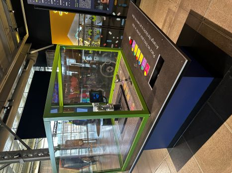
>Photo prise par Félix Roy

## À propos de la réalisation

Cette oeuvre a été crée et inventé par l'entreprise Mecademic et crée il y a très longtemps.

## Explication de l'oeuvre

Pour ce qui est de l'oeuvre, elle permet de recréer des mouvements qui nécessitent une précision surhumaine. Il va être utilisé par exemple dans l'horlogerie pour assembler des micro-engrenage ou par la NASA pour manipuler des particules extraterrestres microscopiques.

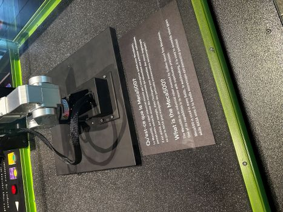
>Photo prise par Félix Roy

## Type d'installation 

Meca500 est bien évidemment de type interactif. En effet, quand les jeunes arrivent pour voir cette oeuvre, ils peut interagir avec le robot. Avec les instructions qui sont situés sur le support, on peut déterminer qu'il faut utilisé les blocs pour faire réagir le robot. Voici les blocs utilisés afin de faire bouger ce fameux robot et les instructions au sol: 

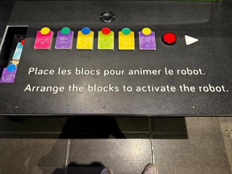  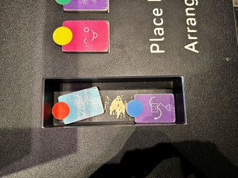 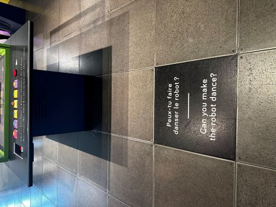
>Photos prises par Félix Roy

## Fonctions du dispositif multimédia 
Il y a quand même beauoup de fonctions du dispositifs multimédia dans cette oeuvre. Premièrement, il y a tous les blocs qui vont servir à faire bouger le robot. Grâce à ceux-ci, il pourra faire plusieurs expressions différentes. Il y a également tout le mécanisme qui sert à faire bouger le bras du Meca500

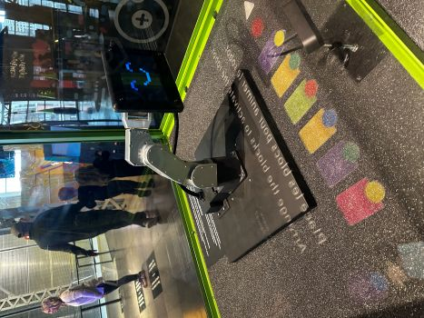 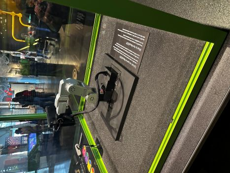
>Photo prise par Félix Roy

## Mise en espace 

Voici un croquis du Meca500 et de sa mise en espace:

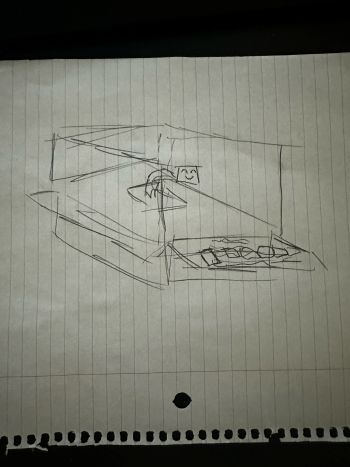

## Composantes et techniques

Les composantes utilisés sont les blocs comme je l'ai montré précédemment et le bras robot.

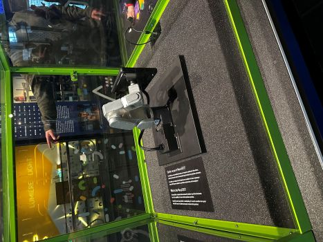 
>Photos prise par Félix Roy
 
## Éléments nécessaires à la mise en exposition

Pour cette oeuvre, il leur fallait un bras mécanique, plusieurs blocs pour le divertissements, un support pour mettre tous ces éléments et une cage en vitre. 

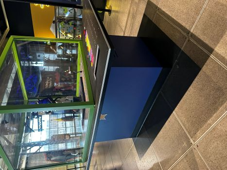 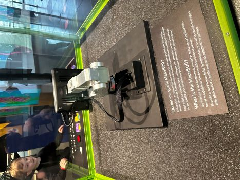
>Photos prises par Félix Roy

## Expérience vécue
J'ai vraiment aimé mon expérience. C'était une exposition que j'avais faites quand j'était petit donc moi, étant nostalgique, j'ai trouvé ça très amusant. De plus que l'exposition n'ai pas changé du tout j'ai vraiment aimé ça. 

## Appréciation

J'ai de plus aimé toutes l'exposition en tant que telle, c'est toujours impressionnant, même à mon âge de voir des experiences scientifiques pareils.
