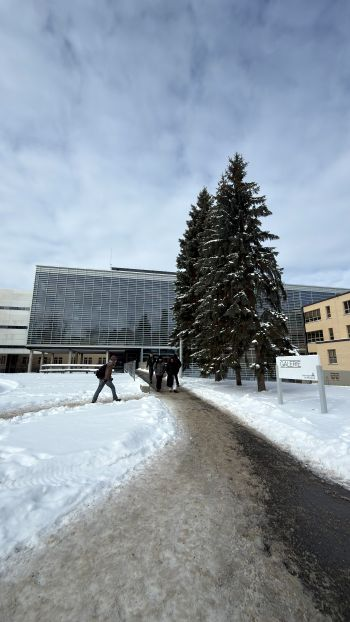
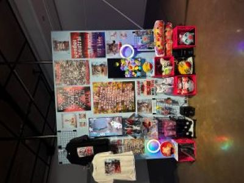
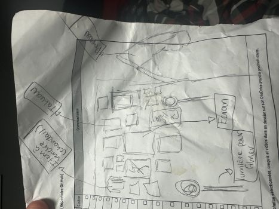
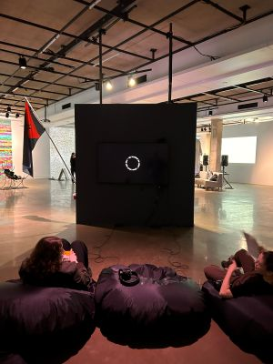
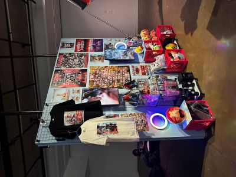
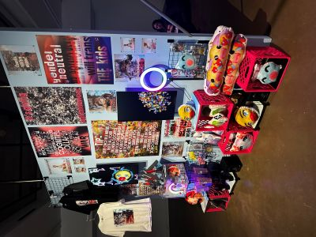
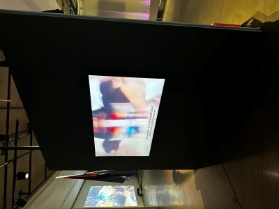
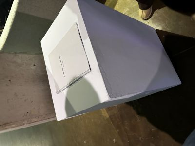
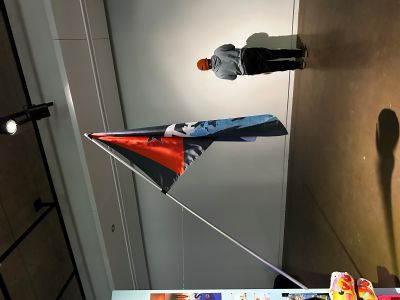

# Devenirs partagés. Pratique de l'IA

Premièrement, notre classe sommes allé voir une exposition au Galerie de l'Univerité de Montréal.

>Photo prise par Alexander

## **Mon exposition**

Le 29 janvier 2026, nous sommes aller voir plusieurs expositions à l'évènement Devenir Partage, Pratique de l'IA. Celle choisi se nomme "SlopPsyopRealism". Cette exposition, qui est dite, temporaire, ne perdurera pas dans le temps. Premièrement car c'est une exposition qui vend des objets pour le financer et deuxièmement, car c'est un projet à court terme selon le créateur. Voici un photo de l'oeuvre en entier:

## **Un peu plus en détail**

Le nom de celui qui a créer cette oeuvre se nomme Francisco Gonzalez-Kosas. Il créa son chef-d'ouevre tout au long de l'année 2025. 

## **Explication de l'oeuvre**

L'oeuvre en tant que telle est globalement une représentation des réseaux sociaux et plus précisément de la folie des réseaux sociaux. Avec tout ces émojis, les écrans un peu partout avec des vidéos loufoques, les peluches et plein d'autres item qui se réfèrent à Internet. Voici un plan (moyennement détaillé) de l'oeuvre de Francisco:

## **Type d'installation**

Pour encore plus préciser la nature de l'oeuvre, on pourrait dire que cette oeuvre est de type comtemplative. En effet, si on regarde bien les deux images ci-dessous, on peut voir que sur la photo de gauche, tout ce qui est montrer sont des choses qu'on doit contempler et regarder. On peut également voir su l'image de droite que les poufs sont une très bonne justification de la contemplation. Ils permettent de s'installer tranquillement pour regarder l'oeuvre à tavers la télé.

 

## **Fonction du dispositif multimédia**

La fonction de l'oeuvre, c'est principalement les écrans. Comme je l'ai dit précédemment, "SlopPsyopRealism" représente la folie des réseaux sociaux. Donc on peut voir qu'il met en valeur les vidéos où il fusionne avec sa soeur et font des formes bizarres. On peut voir aussi les empojis un peu loufoques qui ne représentent absolument rien. Tout ça est bien mit en valeur pour montrer que les réseaux peuvent être aléatoire et absurde. 

## **Mise en espace**

  

## **Composantes et techniques**

Pour créer son oeuvre, il a utilisé plusieurs outils de décorations et de surplus pour bien exprime son travail. Premièrement, nous avons les hauts-parleurs qui permettent de sortir du son. De plus, nous avons des peluches, des télés, des affiche sur le mur et toutes sortes de lumières. 

## **Éléments nécessaires à la mise en exposition**
 Pour son exposition, il eu besoin de bien sur un mur, d'un drapeau et d'un socle. 

  

 ## **Expérience vécue**

Comme on peut le voir ci-dessous, le jeune homme regarde les affiches qui étaient disposés sur les murs près de chaque exposition. Ils étaient tous très clairs et bien disposés. Une fille qui restait près pouvait également nous aide au cas où nous avions des questions. 

## **Appréciation**

 Ce qui m'a plu dans cette oeuvre c'est que je trouve qu'elle me représente. Le point commun que j'ai avec elle, c'est que on aime tous les deux les réseaux sociaux et je pense que c'est pour ça que je me suis rapproché de cette oeuvre. Je penses que si je devais enlever des aspects poru ma propre invention, ça serait le côté où c'est du n'improrte quoi. Le fait que ce qui est représenter, ce soit du n'importe quoi, même si c'est en quelque sorte le but, on ne comprend pas tout de suite et je penses que c'est vrm un désavantage.   

