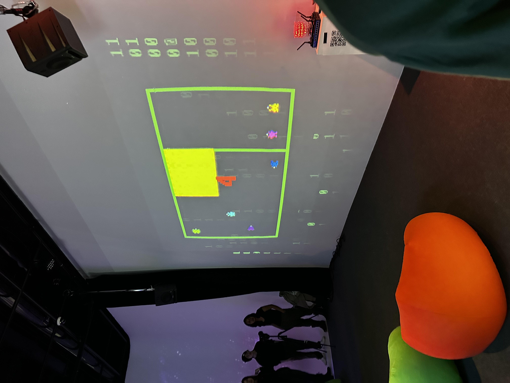

# Réseau vivant 

Voici la fiche documentation d'une oeuvre choisi de l'expostion qui se nomme "Réseau viant"

>Photo prise par Félix Roy

## L'exposition choisie 
Pour ce projet, j'ai choisi de prendre l'incroyable exposition se nommant Terminal. Nous sommes allés le visiter le 17 mars 2026 avec toute notre classe. Voici à quoi ressemble l'exposition: 

