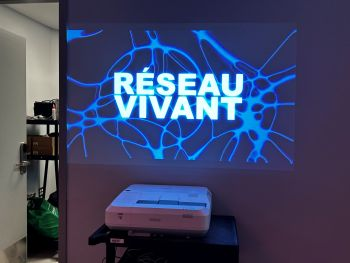
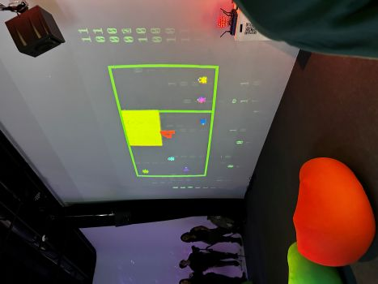
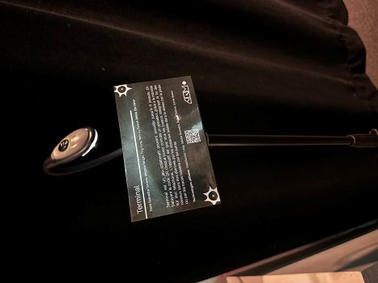
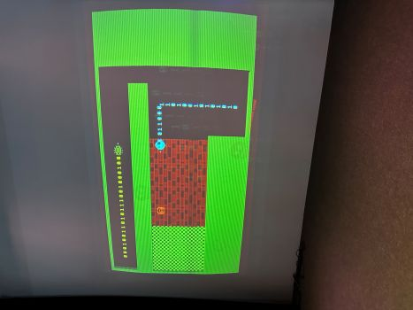
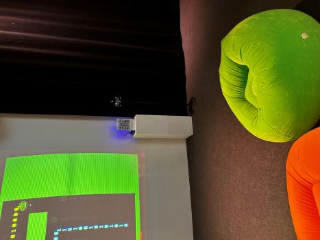
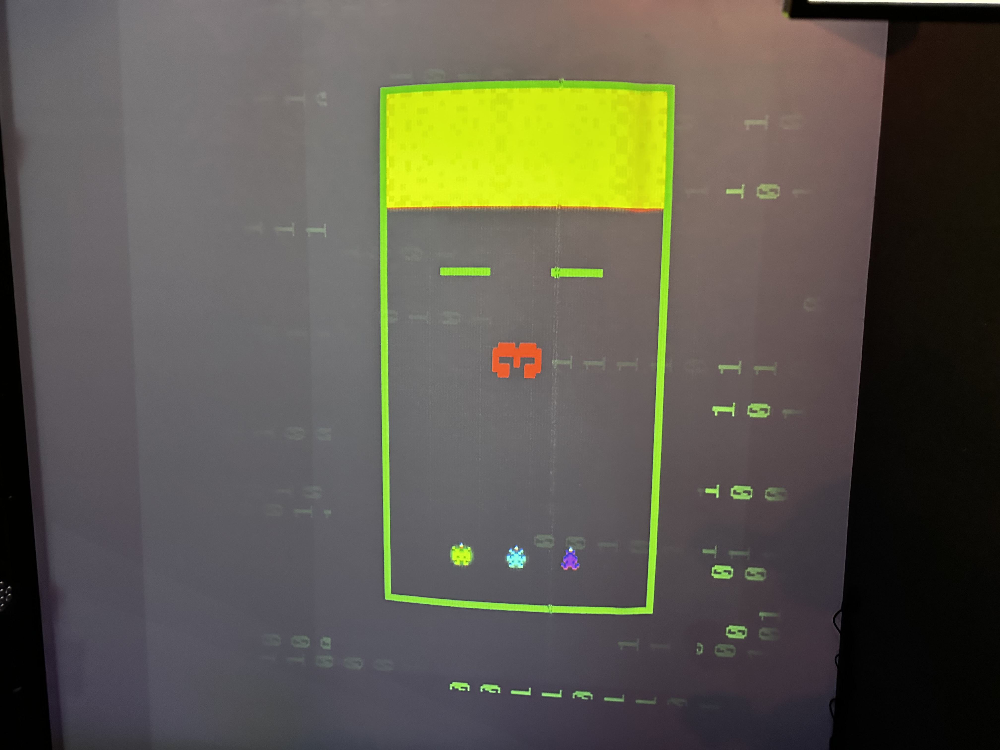

# Réseau vivant 

Voici la fiche documentation d'une oeuvre choisi de l'expostion qui se nomme "Réseau viant"

>Photo prise par Félix Roy

## L'exposition choisie 
Pour ce projet, j'ai choisi de prendre l'incroyable exposition se nommant Terminal. Nous sommes allés le visiter le 17 mars 2026 avec toute notre classe. Voici à quoi ressemble l'exposition: 

> Photo prise par Félix Roy

## À propos de l'oeuvre

Cette oeuvre a été réalisé par Émeryk Belisle, Elie Daher, Ting Yung Lu Terry, Dana Saavedra-Torrano et Mégane Ranger. Ces élèves finissant l'ont crée en au courant de leur dernière session en 2026.

## Description de l'oeuvre 

Cette oeuvre met en valeur la coopération. Elle peut atteindre la capacité maximale de 6 joueurs et ensemble, nous devons s'entraider pour atteindre chacun la ligne d'arrivée. Il existe plusieurs niveaux pour nous mettre de plus en plus à l'épreuve. Plus les niveaux avancent, plus la difficulté s'endurcît. Pour mourir, c'est simple, il faut toucher les cotés ou s'entroicroiser avec ces alliés. Pour ce qui est de rejoindre le jeu, les joueurs commencent par se connecter au QR code sur le cartel et la partie commence!

> Photo prise par Félix Roy

## Type d'installation 

Terminal est de type interactif. En effet, leur but c'est justement de faire jouer plusieurs joueur à la fois en utilisant le cellulaire. C'est donc le joueur qui contrôle le petit personnage sur l'écran.

>Photo prise par Félix Roy

## Fonction du dispositif multimédia

La fonction du dispositif, ce sont le grand écran sur lequel tout s'affiche et également tout ce qui est affiché sur l'écran. C'est avec cela que l'on peut voir notre perso se déplacer. Il y a également la manette, donc le bas, haut, gache et droite sur notre cellulaire. 

 
