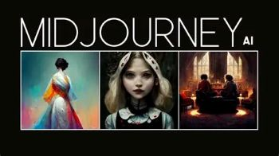

## Palmarès de chaque exposition

|Informations recherchées  |Appui visuel |
| ---      | ---             | 
| No ordre de préférence: 2 || 
| Titre: Symbiose || 
| Noms des créateurs et créatrices: Yannick Chamberland, Benjamin Ferland, Ryan Dufault, Walid Cheour || 
| Installation en cours (ou finale)|| |
| Schéma de l'installation prévue|  |
| Ce que vous ressentez en expérimentant chacune des installations, avec justification (avant/après l'expérimentation) : À première vue, je l'ai trouvé très intéressant et interactif. C'est le deuxième qui m'a le plus attiré l'oeil. J'ai trouvé très amusant le faite que ce soit un travail d'équipe pour faire le plus grand record.  || 

 

|Informations recherchées |Appui visuel |
| ---     | ---             | 
| No ordre de préférence: 3 || 
| Titre: o.i.g.n.o.n. || 
| Noms des créateurs et créatrices: Ahmed Kaissoumi, Radhouane Kordan, Justin Monpetit, Thearylou Lach || 
| Installation en cours (ou finale)|| |
| Schéma de l'installation prévue| |
| Ce que vous ressentez en expérimentant chacune des installations, avec justification (avant/après l'expérimentation): Quand je suis arrivé je l'ai trouvé très complet. C'était une des plus grosses installations après celle de Terminal et je trouvais qu'elle était imposante. Après y avoir joué pour la première fois, je l'ai trouvé un peu compliqué. || 

 

|Informations recherchées |Appui visuel|
| ---     | ---             | 
| No ordre de préférence: 4 || 
| Titre: Océan rouge || 
| Noms des créateurs et créatrices: Amira Tounekti, Kristy Moussaly|| 
| Installation en cours (ou finale)|| |
| Schéma de l'installation prévue| |
| Ce que vous ressentez en expérimentant chacune des installations, avec justification (avant/après l'expérimentation): Honnêtement à première vue, c'était celui qui me donnait le moins envie. En l'a regardant, c'était juste comme une borne d'arcade. Malgré ça, en l'essayant, j'ai bien aimé. Je l'ai trouvé un peu incomplet mais le but ddu jeu est très interessant. || 

 

|Informations recherchées  |Appui visuel |
| ---     | ---             | 
| No ordre de préférence: 5 || 
| Titre: Arbre en Face || 
| Noms des créateurs et créatrices: Alexandre Gendron, Mikael Arseneau, Mathieu Willett, Matis Ghariani, Rafael Angon Dube|| |
| Installation en cours (ou finale)|| |
| Schéma de l'installation prévue||
| Ce que vous ressentez en expérimentant chacune des installations, avec justification (avant/après l'expérimentation): J'ai trouvé que le concept était drôle mais ça s'arrête là. On s'amuse quelques instants mais c'est très court.|| 

 

|Informations recherchées  |Appui visuel |
| ---     | ---             | 
| No ordre de préférence: 6 || 
| Titre: Quand les yeux se croisent || 
| Noms des créateurs et créatrices: Edelwyn Ledru, Félix Lavoie, Jade Hébert, Manel Yaya, Patricia Nassif|| 
| Installation en cours (ou finale)|| |
| Schéma de l'installation prévue| |
| Ce que vous ressentez en expérimentant chacune des installations, avec justification (avant/après l'expérimentation): Avant de l'expérimenter je ne le comprenais pas vraiment et même en l'essayant je ne le comprend pas beaucoup plus donc c'est pourquoi je l'ai mit en dernier. Mais sinon, c'est un beau travail.|| 

  

## Plus d'informations en rapport avec le programme
|Information recherchée  |Appui |
  | ---     | ---             |
  |  Nommer 3 cours du programme qui vous semblent incontournables pour avoir les compétences pour créer ce genre de projet: Œuvres et dispositifs multimédias en exposition, Conception d’une expérience multimédia et Installation multimédia. || |
  | Nommer et décrire une technique **ou** une composante technologique qui est utilisée dans l'**un des projets** et que vous ne connaissiez pas: Le logiciel Midjourney. Je ne connaissait tout simplement pas ce logiciel, mais c'est un logiciel pour générer des images à partir de texte.  ||

