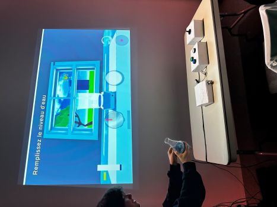
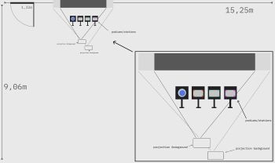
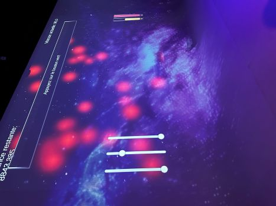
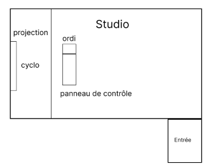
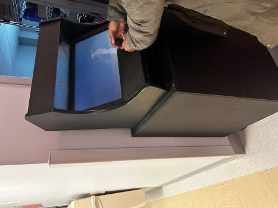
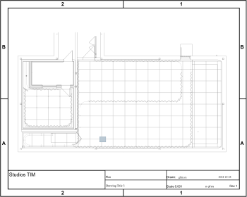
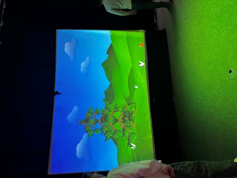
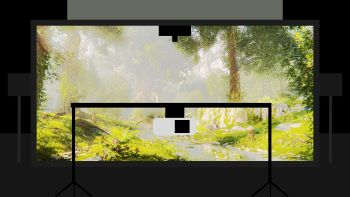
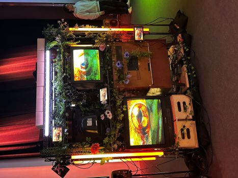
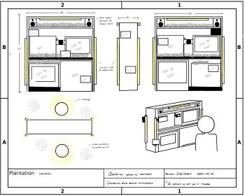

## Palmarès de chaque exposition

|Informations recherchées  |Appui visuel |
| ---     | ---             | 
| No ordre de préférence: 2 || 
| Titre: Symbiose || 
| Noms des créateurs et créatrices: Yannick Chamberland, Benjamin Ferland, Ryan Dufault, Walid Cheour || 
| Installation en cours (ou finale)|| |
| Schéma de l'installation prévue|  |
| Ce que vous ressentez en expérimentant chacune des installations, avec justification (avant/après l'expérimentation)|| 

 

|Informations recherchées |Appui visuel |
| ---     | ---             | 
| No ordre de préférence: 3 || 
| Titre: o.i.g.n.o.n. || 
| Noms des créateurs et créatrices: Ahmed Kaissoumi, Radhouane Kordan, Justin Monpetit, Thearylou Lach || 
| Installation en cours (ou finale)|| |
| Schéma de l'installation prévue| |
| Ce que vous ressentez en expérimentant chacune des installations, avec justification (avant/après l'expérimentation)|| 

 

|Informations recherchées |Appui visuel|
| ---     | ---             | 
| No ordre de préférence: 4 || 
| Titre: Océan rouge || 
| Noms des créateurs et créatrices: Amira Tounekti, Kristy Moussaly|| 
| Installation en cours (ou finale)|| |
| Schéma de l'installation prévue| |
| Ce que vous ressentez en expérimentant chacune des installations, avec justification (avant/après l'expérimentation)|| 

 

|Informations recherchées  |Appui visuel |
| ---     | ---             | 
| No ordre de préférence: 5 || 
| Titre: Arbre en Face || 
| Noms des créateurs et créatrices: Alexandre Gendron, Mikael Arseneau, Mathieu Willett, Matis Ghariani, Rafael Angon Dube|| |
| Installation en cours (ou finale)|| |
| Schéma de l'installation prévue||
| Ce que vous ressentez en expérimentant chacune des installations, avec justification (avant/après l'expérimentation)|| 

 

|Informations recherchées  |Appui visuel |
| ---     | ---             | 
| No ordre de préférence: 6 || 
| Titre: Quand les yeux se croisent || 
| Noms des créateurs et créatrices: Edelwyn Ledru, Félix Lavoie, Jade Hébert, Manel Yaya, Patricia Nassif|| 
| Installation en cours (ou finale)|| |
| Schéma de l'installation prévue| |
| Ce que vous ressentez en expérimentant chacune des installations, avec justification (avant/après l'expérimentation)|| 

  

## Plus d'informations en rapport avec le programme
|Information recherchée  |Appui | Détails supplémentaires |
  | ---     | ---             | --- |
  |  Nommer 3 cours du programme qui vous semblent incontournables pour avoir les compétences pour créer ce genre de projet (voir la [grille de cours du programme](https://www.cmontmorency.qc.ca/programmes/nos-programmes-detudes/techniques/techniques-dintegration-multimedia/grille-de-cours/)) || |
  | Nommer et décrire une technique **ou** une composante technologique qui est utilisée dans l'**un des projets** et que vous ne connaissiez pas. |photo ou croquis de la technique ou composante|Indiquer la source de l'information pour cette recherche |

